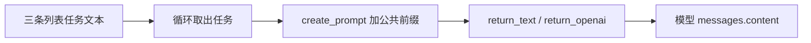

# 工具链阳性样本的 Prompt 漏提复核与修复

复核日期：2026-09-03。正式库更新：17:49:47；更新后快照：17:50:21（北京时间）。状态：提取逻辑已修复，13 个重点样本已备份后更新，关联已重建；本轮未重启运行中的 API。

## 📌 结论

用户指出的 MalTerminal `4c73717d933f` 确实存在漏提。上一轮只根据已有结构化结果讨论缺失原因，不足以证明原始文件没有提示词；本次逐个读取原始文件核验后，已纠正这一点。

13 个“工具链非空、提示词文本为空”的重点样本中，12 个恢复了提示词文本或静态组成部分，1 个 DLL 仍未找到可归属于目标程序的提示词。新增 51 条证据，包括 48 条边界明确的字符串/静态组成部分和 3 条边界未确认的片段。

**51 条证据不等于 51 条完整运行时请求；12/13 是这组已知缺口的恢复情况，不是全项目准确率或召回率。**

“有工具链，通常应进一步查找提示词”在本批中是有效的复核方向，但不能作为强制填充规则：SDK、模型名或端点可能来自依赖、示例或辅助分析程序；输入也可能在运行时从外部提供。

## 🔍 MalTerminal 的复现与根因

### 用户指出的样本

完整 SHA-256：`4c73717d933f6b53c40ed1b211143df8d011800897be1ceb5d4a2af39c9d4ccc`。

旧结果：工具链非空，`features.prompt.embedded_prompts=[]`。预期：识别实际流入模型输入参数的静态文本，并保留来源。

原始源码包含以下输入关系：

本次得到 4 个静态组成部分：

| 源码位置 | 内容性质 | 核验结论 |
|---|---|---|
| 第 15–22 行 | 多行角色/任务指令，含 Unicode 标点 | 可追踪到模型输入 |
| 第 24 行 | 另一条任务指令 | 可追踪到模型输入 |
| 第 28–34 行 | 第二段多行角色/任务指令 | 可追踪到模型输入 |
| 第 64 行 | 公共任务前缀 | 与列表项拼接后传入模型 |

旧提取器依赖少量英文句式模式，例如角色定义中的 “you are a/an/the”，漏掉了 “you are going to act as” 以及普通任务表达；通用 ASCII 字符串提取还会拆散多行、Unicode 文本。更关键的是，它没有追踪列表、循环、包装函数与模型参数之间的依赖关系。

现在以 Python AST 静态依赖关系寻找模型输入来源，不要求输入必须命中某一种英文提示句式。只保留能够静态确认的组成部分，不执行代码、不替用户输入变量补值。上述 4 个组成部分不能表述成 4 次已执行的模型请求。

## 📋 13 个重点样本逐项结果

“新增”均为本次补充条数；修复前每个样本的提示词文本条数均为 0。哈希在本批中以 12 位前缀唯一标识，完整值见审核清单。

| 家族 / SHA-256 前缀 | 新增 | 明确边界 / 未确认 | 已确认原因或限制 |
|---|---:|---|---|
| MalTerminal / `4c73717d933f` | 4 | 4 / 0 | 列表、循环、包装函数；多行角色文本和公共前缀 |
| MalTerminal / `c86a5fcefbf0` | 4 | 4 / 0 | 同类模型参数依赖链与多行文本漏提 |
| MalTerminal / `c1a80983779d` | 16 | 16 / 0 | 多条任务、公共前缀、插值模板静态片段；不是 16 个完整请求 |
| MalTerminal / `68ca559bf665` | 1 | 1 / 0 | 代码/提示词恶意性检测输入；属于分析辅助逻辑 |
| MalTerminal / `e88a7b9ad5d1` | 3 | 3 / 0 | 检测、去混淆相关静态输入组成部分 |
| LAMEHUG / `ae6ed1721d37` | 2 | 2 / 0 | 两条 Base64 常量，经解码后传入模型请求 |
| LAMEHUG / `b49aa9efd41f` | 2 | 2 / 0 | PYC 中的 Base64 常量；需识别字符串长度，避开后续类型标签 |
| LAMEHUG / `a32a3751dfd4` | 0 | 0 / 0 | DLL：有工具链线索，尚未恢复目标程序提示词 |
| PROMPTSTEAL / `766c356d6a4b` | 2 | 2 / 0 | PyInstaller 脚本成员内的编码常量，旧路径依赖恢复工具 |
| PromptLock / `09bf891b7b35` | 5 | 4 / 1 | Go 深层字符串池；4 条有指针与长度证据，1 条仅为窗口 |
| PromptLock / `1458b6dc98a8` | 5 | 4 / 1 | 同上；不能把相邻字符串池视为完整提示词 |
| PromptLock / `e24fe0dd0bf8` | 5 | 4 / 1 | 同上 |
| PromptSpy / `db7a1c352c7d` | 2 | 2 / 0 | 按 DEX 字符串表解析，保留多行与 MUTF-8 文本 |
| 合计 | 51 | 48 / 3 | 12 个恢复，1 个仍待进一步静态分析 |

完整计数、来源偏移、成员哈希、调用位置和限制记录保存在本地运行数据 `data/evaluations/20260903_prompt_context_v1_verified/manifest.json`。该文件是提交前审核清单，里面的 `production_applied=false` 表示其生成时的状态；实际提交成功以同目录的 `applied.json` 为准。评估目录不纳入版本控制。

## 🛠️ 已实现的修复

### Python 模型输入上下文

识别已导入的受支持模型 SDK 调用，以及静态关联到已知模型端点的 HTTP JSON 请求。追踪变量、列表追加、循环、包装函数参数与返回、字符串拼接、f-string 静态部分；排除普通菜单提示、文件读取内容及无法分析的外部函数返回。

Python 源码中的 Base64 只在常量可追踪到 `base64.b64decode` 且流入模型参数时解码。不会执行 `eval`、导入样本、读取样本指定的外部文件或实际调用模型。

### PYC 与 PyInstaller 编码常量

按已识别的长度前缀隔离编码字符串，避免把后一项 Marshal 类型标签拼进无填充 Base64。这里只做有界字节读取，不使用 `marshal.loads` 或执行字节码。

对 PyInstaller CArchive 按目录读取脚本成员并有界解压，跳过引导脚本，不把恢复成源码作为提取这些常量的前提。格式依据 [PyInstaller 官方读取器](https://raw.githubusercontent.com/pyinstaller/pyinstaller/develop/PyInstaller/archive/readers.py)。

同时修复真实新分析入口的相关退化：当前环境缺少反编译工具时，PROMPTSTEAL 仍能从同一脚本成员恢复 Qwen 工具链标记。新分析得到 1 条该标记，历史结果中的 2 条是重复线索；不能把条数减少理解为供应商丢失。本次正式库补充仅修改 Prompt，保留历史工具链原值，未补造代码风格指标。

### Go 字符串边界

在受支持的 PE/ELF 布局中匹配静态字符串指针和长度；有匹配时按确切长度截取。当前每个 PromptLock 恢复 4 条完整字符串，另 1 条校验器文本只有最多 2,048 字节的窗口，明确标记边界未知。

窗口仅保留证据哈希，**不生成 Prompt 全文哈希或模糊哈希，不参与 Prompt 精确/模糊匹配，也不新增全局结构特征标记**。这避免相邻字符串池污染相似度。格式依据：[Go 字符串实现](https://raw.githubusercontent.com/golang/go/master/src/runtime/string.go)、[PE 格式](https://learn.microsoft.com/en-us/windows/win32/debug/pe-format)、[ELF 节结构](https://refspecs.linuxfoundation.org/elf/gabi4%2B/ch4.sheader.html)。

### APK / DEX

不再仅依赖通用字符串列表的前 5,000 条：在受限 APK 成员内按 DEX 字符串表、ULEB128 长度和 MUTF-8 解析文本，保留多行与 Unicode。PromptSpy 的两个 DEX 共检查 109,109 条字符串，得到 2 条提示词候选；未做 DEX 调用图证明。格式依据 [Android DEX 官方文档](https://source.android.com/docs/core/runtime/dex-format)。

开发中曾误收 SQL 和库错误字符串，已收紧未绑定二进制候选的“请求句式 + 任务语境”条件，并加入负例回归；不是把所有包含 prompt/code 的文本都收进来。

实现位于 [prompt_recovery.py](../src/ai_signal_hub/prompt_recovery.py)、[binary_layout.py](../src/ai_signal_hub/binary_layout.py) 和统一入口 [legacy.py](../src/ai_signal_hub/legacy.py)。未修改两个旧项目。

## ⚖️ 准确性边界与未解决问题

1. **DLL 不能强填。** `a32a3751dfd4` 是约 32.4 MiB 的 PE DLL，已有 GPT-4o、Hugging Face 端点、OpenAI SDK 等线索；部分命中附近包含依赖库文档/示例。目前没有确认属于目标程序的 Prompt，不表示其绝对不存在，也不能断言全部工具链都是误报。
2. **分析助手不等于攻击载荷。** `68ca559bf665`、`e88a7b9ad5d1` 含 LLMorpher 检测/分析逻辑。应提取它们的模型输入，但不能因放在 MalTerminal 目录就据此确认文件自身实施攻击。本次未擅自修改家族或旧分类。
3. **字符串边界明确不等于调用已确认。** Python 证据标记为静态依赖候选；DEX、Go 和二进制编码常量的模型调用绑定尚未验证。
4. **不还原未知运行时值。** Python 当前是作用域内保守依赖并集，不是路径敏感分析；循环、分支、共享函数可能汇总多种来源。短片段、公共前缀的相似不代表完整提示词相同，更不能据此证明同源。
5. **受支持范围仍有限。** 暂不承诺完整支持动态解密、外部配置输入、所有 SDK 别名、复杂对象属性传递、所有二进制或所有提示语言句式。不会因为某个阶段返回 0 就判定“没有提示词”。
6. **扫描有资源边界。** 输入最多 100 MiB，Python 源码 2 MiB / 50,000 AST 节点，单条文本 32,768 字符，最多 100 个新候选；容器成员 32 MiB、累计解压 120 MiB，并有 APK 成员数与压缩比检查。超限/不支持情况留在诊断中，不能把有界扫描宣称全量恢复。

所有新增候选均标记为静态候选，不证明真实运行、恶意用途或 AI 生成。原样本中的凭据没有被使用或验证，本说明也不复制凭据和完整恶意任务文本。

## ✅ 验证结果

| 验证项 | 结果 | 证明范围 |
|---|---|---|
| 专项及原有测试 | 168 项通过，其中新增专项 29 项 | 回归与安全边界，不是语义准确率 |
| 编译检查 | src / tests / scripts 通过 | Python 语法可加载 |
| 45 个原始文件隔离预览 | 哈希核验通过 | 文件身份一致；原文件未改 |
| 51 条新增证据逐条回查 | 来源字节、变换和文本哈希匹配 | 能回溯到原始文件或容器成员 |
| 13 个真实静态分析入口 | 顶层错误均为 0；新增 Prompt 与预览一致 | 上传分析所调用的统一适配入口可复现 |
| 数据范围 | 13 行仅更新允许列，其他 32 行保持不变 | 原证据、工具链、代码、分类均保留 |
| 实时 API | 13 个详情的计数和恢复版本均匹配 | 用户读取到的已是本次更新结果 |

原有测试存在 1 条 Starlette/httpx 弃用警告，不影响通过；未为此改动依赖。

45 个隔离预览中另有 2 个原本已经有 Prompt 的样本可增加组成部分，本次没有将它们混入 13 个缺口的更新范围。历史证据未被覆盖；全量验证不等于全量换库。

测试文件：[test_prompt_recovery.py](../tests/test_prompt_recovery.py)。逐条来源、数据差异验证和真实入口批次结果保存在本地 `data/evaluations/` 下，评估产物不纳入版本控制。

## 💾 知识库与 API 生效情况

| 全库指标 | 修复前 | 本次更新后 |
|---|---:|---:|
| 样本数 | 45 | 45 |
| 有工具链证据 | 25 | 25 |
| 有 Prompt 文本候选 | 13 | 25 |
| 有工具链但无 Prompt 文本 | 13 | 1 |
| 只有 Prompt 结构、无文本 | 3 | 0 |
| 有可用代码指标 | 20 | 20 |
| 至少一组可用特征 | 35 | 35 |
| 三组均无可用特征 | 10 | 10 |

本次补的是原本已有工具链的样本，因此“35 个至少一组可用、10 个三组空”的总体覆盖没有变化。更新后完整快照保存在本地 `data/evaluations/20260903_inventory45_after_prompt_repair/inventory.json`。

正式库先做 SQLite 一致性备份，再在单一事务中更新 13 个样本的 `result_json / artifact_path / updated_at`，并替换经过预览的三张关联派生表。45 个样本重建 990 对关系、29 个候选簇，距离阈值仍为 0.45，没有通过调阈值“制造关联”。

旧样本文件和旧分析产物均保留；报告、事件、案例、历史交叉验证和已生成统计报告均未改写。历史交叉验证是历史快照，若要看到新 Prompt 对报告的支持/补充关系，需要重新执行对应案例的交叉验证。

备份和提交记录分别保存在本地 `data/evaluations/20260903_prompt_context_v1_verified/knowledge.before.db` 与 `applied.json`。回退应基于该备份核对并恢复指定内容；若提交后已有新数据，不应直接覆盖整库。

API 路径未改变，`GET /api/v1/samples/{sha256}` 中查看：

- `result_json.features.prompt.embedded_prompts`：文本/静态组成部分、边界、完整性、调用绑定状态、比较资格及原始位置。
- `result_json.features.prompt.recovery_diagnostics`：恢复版本、阶段、扫描数量、限制和候选数量。
- 单条 `recovery_origin`：字节偏移、原始跨度哈希、变换；容器成员另带成员名称与哈希。
- `comparison_eligible=false`：仅作证据展示，不将该窗口当完整 Prompt 计算精确或模糊相似度。

**这 13 个已有结果已经能通过当前 API 读到，无需再次上传。运行中的 API 尚未重启，后续新上传/重新分析要使用新提取逻辑，仍需重启 API。** 不要把“选择已有样本”“重新交叉验证”或“重建关联”当成重新提取。服务重启前也应避免重分析这些样本，以免仍使用旧逻辑覆盖新结果。

## 🧭 下一步优先级

- P1：继续定位 DLL `a32a3751dfd4` 的业务模块与依赖边界；只接纳有来源依据的目标输入，不拿 SDK 示例补空字段。
- P1：完善 PromptLock 校验器的精确边界，并增加二进制调用归属分析；确认前继续保留片段身份。
- P1：引入完整输入、模板组成部分、窗口片段三种比较口径，进一步降低公共前缀对相似度的影响；当前分数仍只是证据候选关系。
- P1：增加文件角色审核，区分攻击载荷、分析/检测辅助工具、依赖、报告和占位文件。
- P2：建立逐字段人工金标准和固定正负例集，分别衡量召回、误收、归属和完整性；不要再仅凭字段非空或任务无报错评价准确性。
